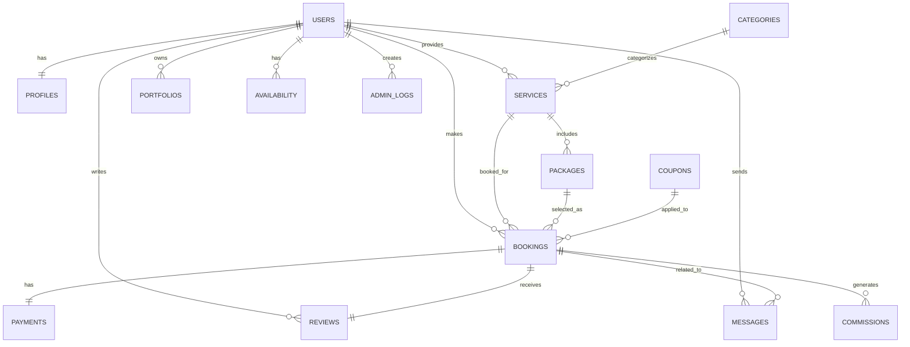

# BookMyShoot ER Diagram

## Entity Relationships

## Key Entities

### USERS
- id (PK)
- name
- email (unique)
- phone
- role (client/pro/admin)
- password_hash
- locale
- created_at
- updated_at

### PROFILES
- user_id (PK, FK)
- business_name
- bio
- location_city
- location_area
- lat
- lng
- languages
- avg_rating
- portfolio_count
- created_at

### SERVICES
- id (PK)
- pro_id (FK)
- title
- category
- description
- base_price
- duration_minutes
- is_active
- created_at
- updated_at

### PACKAGES
- id (PK)
- service_id (FK)
- name
- price
- hours
- details
- created_at

### PORTFOLIOS
- id (PK)
- pro_id (FK)
- media_url
- media_type
- caption
- thumbnail_url
- created_at

### AVAILABILITY
- id (PK)
- pro_id (FK)
- date
- start_time
- end_time
- is_booked

### BOOKINGS
- id (PK)
- client_id (FK)
- pro_id (FK)
- service_id (FK)
- package_id (FK)
- date
- start_time
- end_time
- status
- total_price
- deposit_paid
- payment_id (FK)
- created_at

### PAYMENTS
- id (PK)
- booking_id (FK)
- amount
- currency
- provider
- status
- transaction_id
- created_at

### REVIEWS
- id (PK)
- booking_id (FK)
- client_id (FK)
- pro_id (FK)
- rating
- comment
- created_at

### MESSAGES
- id (PK)
- booking_id (FK)
- from_user (FK)
- to_user (FK)
- message
- attachments
- created_at

### CATEGORIES
- id (PK)
- name (unique)
- description
- created_at

### COUPONS
- id (PK)
- code (unique)
- discount_type
- discount_value
- valid_from
- valid_to
- max_uses
- used_count
- is_active
- created_at

### COMMISSIONS
- id (PK)
- booking_id (FK)
- pro_id (FK)
- amount
- status
- paid_at
- created_at

### ADMIN_LOGS
- id (PK)
- admin_id (FK)
- action
- table_name
- record_id
- details
- created_at